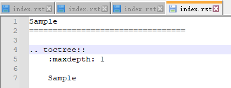

# 使用ReadTheDocs构建托管技术文档

## 前置准备

1. ReadTheDocs 账号
2. Github（Gitee）账号
3. Python环境（如anaconda3）
4. Typora（最后一个免费版本 0.11.18）


Github新建项目

在github（gitee）上新建项目，如ReadTheDocsNote


## Sphinx安装与测试


打开Anaconda Prompt 


安装Sphinx

```bash
pip install sphinx
```

构建项目文档

```bash
# 将刚才在github（gitee）新建的项目，克隆到本地
git clone git@gitee.com:dimwalker/ReadTheDocsNote.git
# 切换目录
cd ReadTheDocsNote
# 创建项目
sphinx-quickstart
```

按提示设置项目文档信息


编译

```
make html
```


查看页面效果

方式1，直接双击 build/html/index.html

方式2，部署http服务器

```bash
# 安装sphinx-autobuild
pip install sphinx-autobuild
# 启动服务
sphinx-autobuild source build/html
```

更换主体

默认主体是alabaster，ReadTheDocs上常见的主体是sphinx_rtd_theme

```
# 安装主题 
pip install sphinx_rtd_theme
```

> 其他注意可以访问 https://sphinx-themes.org/

修改conf.py

```
html_theme = 'sphinx_rtd_theme'
```


配置Markdown

Sphinx默认只支持reST格式，Markdown需要安装插件

```
# markdown
pip install recommonmark
# markdown表格
pip install sphinx_markdown_tables
```

修改conf.py

```
extensions = ['recommonmark','sphinx_markdown_tables']
```


使用Typora编写文档

修改 偏好设置 -> 图像


打开 视图 -> 文件树

如果路径不在项目上，点击最下面，打开文件夹


新建md文档

在目录右键，新建docs/Sample.md


打开Sample.md，编辑内容

使用其他文本编辑器

打开source/index.rst，并编辑

```
Sample Markdown
=================================

.. toctree::
   :maxdepth: 2

   docs/index
```


新建source/docs/index.rst，编辑

```
Sample
=================================
 
.. toctree::
    :maxdepth: 1

    Sample
```

