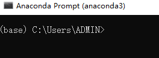
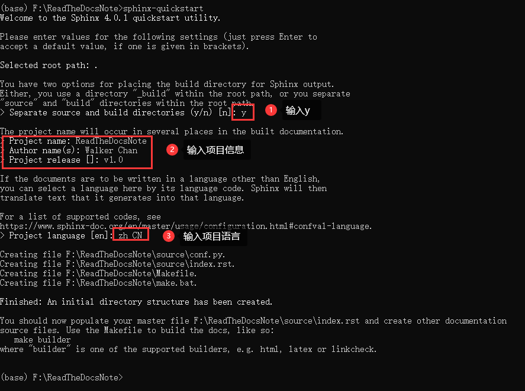
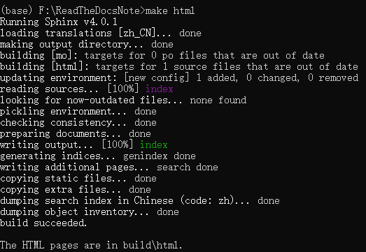
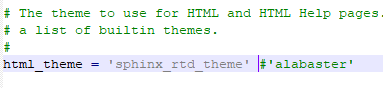
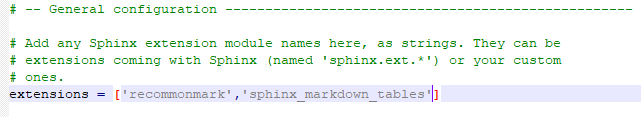
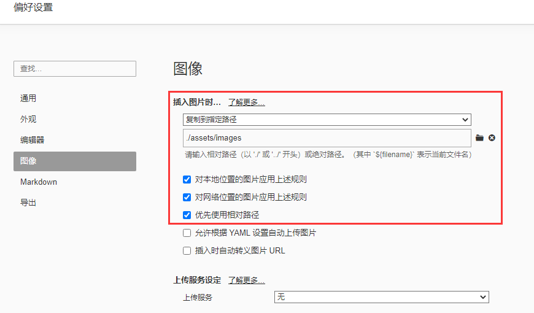
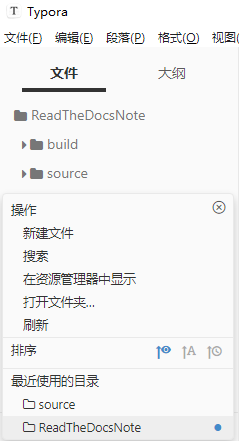
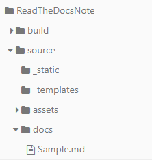
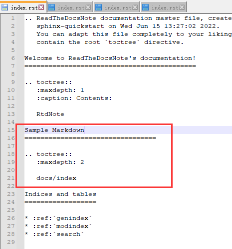

# 使用ReadTheDocs构建托管技术文档

## 前置准备

1. ReadTheDocs 账号
2. Github（Gitee）账号
3. Python环境（如anaconda3）
4. Typora（最后一个免费版本 0.11.18）


Github新建项目

在github（gitee）上新建项目，如ReadTheDocsNote


## Sphinx安装与测试


打开Anaconda Prompt 



安装Sphinx

```bash
pip install sphinx
```

构建项目文档

```bash
# 将刚才在github（gitee）新建的项目，克隆到本地
git clone git@gitee.com:dimwalker/ReadTheDocsNote.git
# 切换目录
cd ReadTheDocsNote
# 创建项目
sphinx-quickstart
```

按提示设置项目文档信息



编译

```
make html
```



查看页面效果

方式1，直接双击 build/html/index.html

方式2，部署http服务器

```bash
# 安装sphinx-autobuild
pip install sphinx-autobuild
# 启动服务
sphinx-autobuild source build/html
```

更换主体

默认主体是alabaster，ReadTheDocs上常见的主体是sphinx_rtd_theme

```
# 安装主题 
pip install sphinx_rtd_theme
```

> 其他注意可以访问 https://sphinx-themes.org/

修改conf.py

```
html_theme = 'sphinx_rtd_theme'
```



配置Markdown

Sphinx默认只支持reST格式，Markdown需要安装插件

```
# markdown
pip install recommonmark
# markdown表格
pip install sphinx_markdown_tables
```

修改conf.py

```
extensions = ['recommonmark','sphinx_markdown_tables']
```



使用Typora编写文档

修改 偏好设置 -> 图像



打开 视图 -> 文件树

如果路径不在项目上，点击最下面，打开文件夹



新建md文档

在目录右键，新建docs/Sample.md



打开Sample.md，编辑内容

使用其他文本编辑器

打开source/index.rst，并编辑

```
Sample Markdown
=================================

.. toctree::
   :maxdepth: 2

   docs/index
```



新建source/docs/index.rst，编辑

```
Sample Markdown
=================================
 
.. toctree::
    :maxdepth: 1

    Sample
```

项目根目录新建.gitignore文件，排除build文件夹

```
build/
```

新建requirements.txt

```
alabaster==0.7.12
appdirs==1.4.4
Babel==2.9.1
beautifulsoup4==4.9.3
bs4==0.0.1
certifi==2020.12.5
chardet==4.0.0
colorama==0.4.4
commonmark==0.9.1
cpplint==1.5.4
distlib==0.3.1
docutils==0.16
fake-useragent==0.1.11
filelock==3.0.12
fishbase==1.3
flake8==3.9.2
idna==2.10
imagesize==1.2.0
importlib-metadata==3.9.1
importlib-resources==5.1.2
install==1.3.4
Jinja2==3.0.1
livereload==2.6.3
Markdown==3.3.4
MarkupSafe==2.0.1
mccabe==0.6.1
packaging==21.0
pycodestyle==2.7.0
pyflakes==2.3.1
Pygments==2.9.0
pyparsing==2.4.7
python-dateutil==2.8.1
pytz==2021.1
PyYAML==5.4.1
recommonmark==0.7.1
redis==3.5.3
requests==2.25.1
six==1.15.0
snowballstemmer==2.1.0
soupsieve==2.2.1
Sphinx==4.0.3
sphinx-autobuild==2021.3.14
sphinx-markdown-tables==0.0.15
sphinx-rtd-theme==0.5.2
sphinxcontrib-applehelp==1.0.2
sphinxcontrib-devhelp==1.0.2
sphinxcontrib-htmlhelp==2.0.0
sphinxcontrib-jsmath==1.0.1
sphinxcontrib-qthelp==1.0.3
sphinxcontrib-serializinghtml==1.1.5
tornado==6.1
typing-extensions==3.7.4.3
urllib3==1.26.4
virtualenv==20.4.3
zipp==3.4.1

```

  