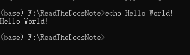

# 一级标题

## 二级标题

### 三级标题

#### 四级标题

##### 五级标题


- 表格

| 1    | 2    | 3    |
| ---- | ---- | ---- |
|      |      |      |
|      |      |      |
|      |      |      |

- 代码

```
echo Hello World!
```

- 截图转本地文件

